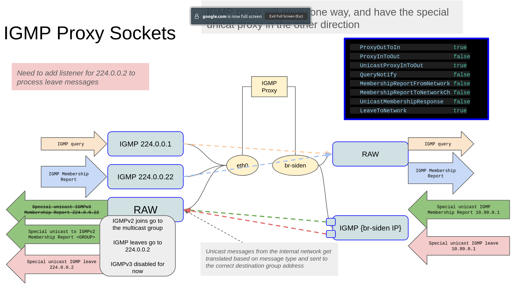

# goIGMP
go IGMP toys

This is a little go library to allow handling of IGMP messages for different scenarios.

It was mostly designed to allow proxing IGMP messages into a docker bridge network
to containers.  There is a special unicast response mode which allows crafting
specific IGMP responses in the case you do not want to jsut let the kernel respond.  Essentailly, this allows you to control which IGMP responses come out of the docker network.

## Interfaces "outside" and "inside"

The interface names are named outside and inside a little like an old Cisco PIX.

Potentially "upstream" and "downstream" would have been better names.

When there are x2 outside interfaces, the second interface is named "alternative" or "alt".

## Proxy from outside to inside

```bash
   ProxyOutToIn                true
   ProxyInToOut                false
   UnicastProxyInToOut         true
   QueryNotify                 false
   MembershipReportFromNetwork false
   MembershipReportToNetworkCh false
   UnicastMembershipResponse   false
```



## Two (2) outside interfaces

Allow for x2 outside interfaces, with a channel to allow an application to signal which outside interface to use.

```bash
   ProxyOutToIn                true
   ProxyInToOut                false
   UnicastProxyInToOut         true
   QueryNotify                 false
   MembershipReportFromNetwork false
   MembershipReportToNetworkCh false
   UnicastMembershipResponse   false
```


Full Proxy Mode

```bash
   outName                     enp1s0
   altName                     gre0
   inName                      dockerbr
   ProxyOutToIn                true
   ProxyInToOut                true
   UnicastProxyInToOut         true
   QueryNotify                 false
   MembershipReportFromNetwork false
   MembershipReportToNetworkCh false
   UnicastMembershipResponse   false
```


Client mode

Client mode setups up channels
- QueryNotifyCh struct{}
- MembershipReportToNetworkCh []membershipItem
- MembershipReportFromNetworkCh []membershipItem


```bash
type membershipItem struct {
   Source       netip.Addr
   Group        netip.Addr
}
```


```bash
   outName                     enp1s0
   inName                      dockerbr
   ProxyOutToIn                false
   ProxyInToOut                false
   UnicastProxyInToOut         false
   QueryNotify                 true
   MembershipReportFromNetwork true
   MembershipReportToNetworkCh true
   UnicastMembershipResponse   true
```


This is an example of using the proxy from outside to inside, and then having
a special application controlling the IGMP responses that leave the docker network.


Code to:
- send IGMP membership reports
- recieve IGMP membership queries

## IGMP version support

The code essenially just copies the entire payload, but was tested against IGMPv3.

IGMPv2 sends the join on the multicast group in question, so this code doesn't really do that.  It could be extended to support this easily enough I suppose.

## IGMPv3

Internet Group Management Protocol, Version 3
https://www.rfc-editor.org/rfc/rfc3376

### Message Formats
https://www.rfc-editor.org/rfc/rfc3376#section-4

```bash
IGMP messages are encapsulated in IPv4 datagrams, with an IP protocol
number of 2.  Every IGMP message described in this document is sent
with an IP Time-to-Live of 1, IP Precedence of Internetwork Control
(e.g., Type of Service 0xc0), and carries an IP Router Alert option
[RFC-2113] in its IP header.
```
- IP protocol = 2
- TTL = 1
- IP Precedence = 0xc0
- Router alert

## Router Alert

Router alert: https://www.rfc-editor.org/rfc/rfc2113

```bash
   The Router Alert option has the following format:

                 +--------+--------+--------+--------+
                 |10010100|00000100|  2 octet value  |
                 +--------+--------+--------+--------+

   Type:
     Copied flag:  1 (all fragments must carry the option)
     Option class: 0 (control)
     Option number: 20 (decimal)

   Length: 4

   Value:  A two octet code with the following values:
     0 - Router shall examine packet
     1-65535 - Reserved
```

```bash
10010100 = 0x94
00000100 = 0x04
```


```bash
Type Number (hex)   Message Name
-----------------   ------------
	  0x11          Membership Query
	  0x22          Version 3 Membership Report
```

## IGMPv2

https://www.rfc-editor.org/rfc/rfc2236

```bash
0                   1                   2                   3
0 1 2 3 4 5 6 7 8 9 0 1 2 3 4 5 6 7 8 9 0 1 2 3 4 5 6 7 8 9 0 1
+-+-+-+-+-+-+-+-+-+-+-+-+-+-+-+-+-+-+-+-+-+-+-+-+-+-+-+-+-+-+-+-+
|      Type     | Max Resp Time |           Checksum            |
+-+-+-+-+-+-+-+-+-+-+-+-+-+-+-+-+-+-+-+-+-+-+-+-+-+-+-+-+-+-+-+-+
|                         Group Address                         |
+-+-+-+-+-+-+-+-+-+-+-+-+-+-+-+-+-+-+-+-+-+-+-+-+-+-+-+-+-+-+-+-+
```

### 4.1. Membership Query Message

```bash
0                   1                   2                   3
0 1 2 3 4 5 6 7 8 9 0 1 2 3 4 5 6 7 8 9 0 1 2 3 4 5 6 7 8 9 0 1
+-+-+-+-+-+-+-+-+-+-+-+-+-+-+-+-+-+-+-+-+-+-+-+-+-+-+-+-+-+-+-+-+
|  Type = 0x11  | Max Resp Code |           Checksum            |
+-+-+-+-+-+-+-+-+-+-+-+-+-+-+-+-+-+-+-+-+-+-+-+-+-+-+-+-+-+-+-+-+
|                         Group Address                         |
+-+-+-+-+-+-+-+-+-+-+-+-+-+-+-+-+-+-+-+-+-+-+-+-+-+-+-+-+-+-+-+-+
| Resv  |S| QRV |     QQIC      |     Number of Sources (N)     |
+-+-+-+-+-+-+-+-+-+-+-+-+-+-+-+-+-+-+-+-+-+-+-+-+-+-+-+-+-+-+-+-+
|                       Source Address [1]                      |
+-                                                             -+
|                       Source Address [2]                      |
+-                              .                              -+
.                               .                               .
.                               .                               .
+-                                                             -+
|                       Source Address [N]                      |
+-+-+-+-+-+-+-+-+-+-+-+-+-+-+-+-+-+-+-+-+-+-+-+-+-+-+-+-+-+-+-+-+
```

### 4.2. Version 3 Membership Report Message

```bash
0                   1                   2                   3
0 1 2 3 4 5 6 7 8 9 0 1 2 3 4 5 6 7 8 9 0 1 2 3 4 5 6 7 8 9 0 1
+-+-+-+-+-+-+-+-+-+-+-+-+-+-+-+-+-+-+-+-+-+-+-+-+-+-+-+-+-+-+-+-+
|  Type = 0x22  |    Reserved   |           Checksum            |
+-+-+-+-+-+-+-+-+-+-+-+-+-+-+-+-+-+-+-+-+-+-+-+-+-+-+-+-+-+-+-+-+
|           Reserved            |  Number of Group Records (M)  |
+-+-+-+-+-+-+-+-+-+-+-+-+-+-+-+-+-+-+-+-+-+-+-+-+-+-+-+-+-+-+-+-+
|                                                               |
.                                                               .
.                        Group Record [1]                       .
.                                                               .
|                                                               |
+-+-+-+-+-+-+-+-+-+-+-+-+-+-+-+-+-+-+-+-+-+-+-+-+-+-+-+-+-+-+-+-+
|                                                               |
.                                                               .
.                        Group Record [2]                       .
.                                                               .
|                                                               |
+-+-+-+-+-+-+-+-+-+-+-+-+-+-+-+-+-+-+-+-+-+-+-+-+-+-+-+-+-+-+-+-+
|                               .                               |
.                               .                               .
|                               .                               |
+-+-+-+-+-+-+-+-+-+-+-+-+-+-+-+-+-+-+-+-+-+-+-+-+-+-+-+-+-+-+-+-+
|                                                               |
.                                                               .
.                        Group Record [M]                       .
.                                                               .
|                                                               |
+-+-+-+-+-+-+-+-+-+-+-+-+-+-+-+-+-+-+-+-+-+-+-+-+-+-+-+-+-+-+-+-+
```

where each Group Record has the following internal format:

```bash
+-+-+-+-+-+-+-+-+-+-+-+-+-+-+-+-+-+-+-+-+-+-+-+-+-+-+-+-+-+-+-+-+
|  Record Type  |  Aux Data Len |     Number of Sources (N)     |
+-+-+-+-+-+-+-+-+-+-+-+-+-+-+-+-+-+-+-+-+-+-+-+-+-+-+-+-+-+-+-+-+
|                       Multicast Address                       |
+-+-+-+-+-+-+-+-+-+-+-+-+-+-+-+-+-+-+-+-+-+-+-+-+-+-+-+-+-+-+-+-+
|                       Source Address [1]                      |
+-                                                             -+
|                       Source Address [2]                      |
+-                                                             -+
.                               .                               .
.                               .                               .
.                               .                               .
+-                                                             -+
|                       Source Address [N]                      |
+-+-+-+-+-+-+-+-+-+-+-+-+-+-+-+-+-+-+-+-+-+-+-+-+-+-+-+-+-+-+-+-+
|                                                               |
.                                                               .
.                         Auxiliary Data                        .
.                                                               .
|                                                               |
+-+-+-+-+-+-+-+-+-+-+-+-+-+-+-+-+-+-+-+-+-+-+-+-+-+-+-+-+-+-+-+-+
```

## GoPacket

https://github.com/randomizedcoder/gopacket
https://github.com/randomizedcoder/gopacket/layers

https://github.com/randomizedcoder/gopacket/

https://github.com/randomizedcoder/gopacket/blob/master/layers/igmp.go
https://github.com/randomizedcoder/gopacket/blob/master/layers/igmp_test.go

IGMP Query
https://github.com/randomizedcoder/gopacket/blob/master/layers/igmp.go#L78

IGMP Membership Report
https://github.com/randomizedcoder/gopacket/blob/master/layers/igmp.go#L162


See also
https://github.com/jmylchreest/igmpqd
https://github.com/individuwill/mcast/

## IGMP Leaves

We found during testing that a Cisco 3750 with IGMP snooping would not withdraw port memebership without
and IGMP leave being sent.  Juniper EX2200 does withdraw the membership if there's no membership report
for some time.  For this reason, we added IGMP leave support.  We are NOT tracking the membership
within goIGMP, so it's to the managing process to send on the LeaveToNetworkCh to send the IGMP leaves.

```bash
LeaveToNetwork
```