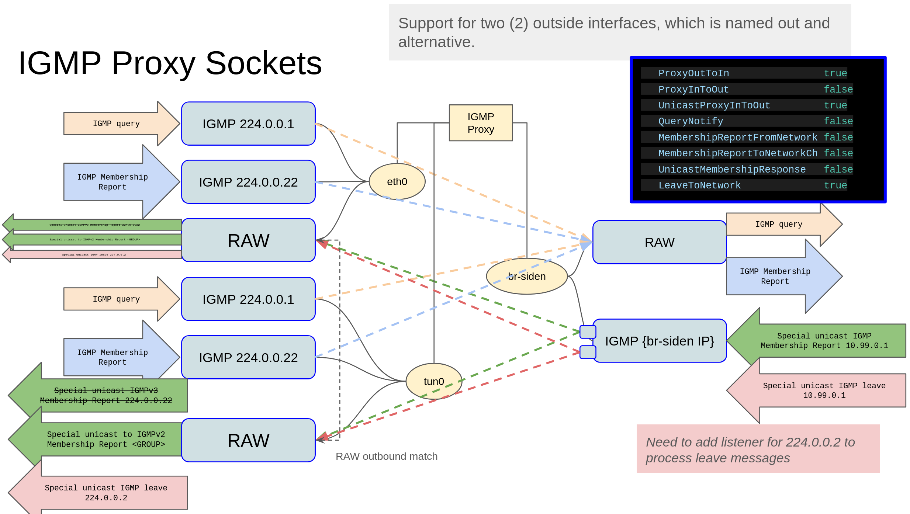

# goIGMP

go IGMP toys

This is a little go library to allow handling of IGMP messages for different scenarios.

It was mostly designed to allow proxing IGMP messages into a docker bridge network
to containers.  There is a special unicast response mode which allows crafting
specific IGMP responses in the case you do not want to jsut let the kernel respond.

Essentailly, this allows you to control which IGMP responses come out of the docker network.

The initial implmentation was targeting IGMPv3, but then it had to be changed to IGMPv2.
Currently the IGMPv2 is the tested path, but most of the IGMPv3 code still remains, and
will proobably only require small changes if something doesn't work.

## Modes

goIGMP essentially has x2 modes:
- Proxy mode
Proxy mode does IGMP proxying.

- Client mode
The client mode is designed to be integrated with another go application, allowing the go
application to open the IGMP sockets on a conatiner running on the inside network.
The go app can then use simple go channels to allow it to offload IGMP generation to goIGMP.
The "example" folder includes an example membership_reporter.go.
This client sends special unicast IGMP messages, which are the messages the proxy code
will translate from unicast and send to the outside as multicast.


## Special Unicast IGMP

This library was designed to allow IGMP membership reports to be selectively sent to the
outside network.  This is because there was a require to always have multicast sockets
open on the container in the docker network, but to only send the IGMP membership reports
wehn users were requesting the stream.

Essentially, this means that this proxy is doing special user level proxying, while the
kernel IGMP code can continue to run unchanged.  It is the unicast IGMP messages that allows
this to happen.

Wireshark is unhappy about the unciast IGMP, but it does work perfectly well.  You will
see the packets marked as red, and that's ok.

We use this IGMP proxy in conjuctions with SMCRoute https://github.com/troglobit/smcroute


## Interfaces "outside" and "inside"

The interface names are named outside and inside a little like an old Cisco PIX.

Potentially "upstream" and "downstream" would have been better names.

When there are x2 outside interfaces, the second interface is named "alternative" or "alt".

The reason x2 outside interfaces exists, is because it was intended to support and Ethernet
and a GRE interface, and allow the multicast to flow over either of these.


## Proxy from outside to inside

```bash
   ProxyOutToIn                true
   ProxyInToOut                false
   UnicastProxyInToOut         true
   QueryNotify                 false
   MembershipReportFromNetwork false
   MembershipReportToNetworkCh false
   UnicastMembershipResponse   false
   LeaveToNetwork              true
```


## Two (2) outside interfaces

Allow for x2 outside interfaces, with a channel to allow an application to signal which outside interface to use.

```bash
   ProxyOutToIn                true
   ProxyInToOut                false
   UnicastProxyInToOut         true
   QueryNotify                 false
   MembershipReportFromNetwork false
   MembershipReportToNetworkCh false
   UnicastMembershipResponse   false
   LeaveToNetwork              true
```


Full Proxy Mode

```bash
   outName                     enp1s0
   altName                     gre0
   inName                      dockerbr
   ProxyOutToIn                true
   ProxyInToOut                true
   UnicastProxyInToOut         true
   QueryNotify                 false
   MembershipReportFromNetwork false
   MembershipReportToNetworkCh false
   UnicastMembershipResponse   false
   LeaveToNetwork              true
```


Client mode

Client mode setups up channels
- QueryNotifyCh struct{}
- MembershipReportToNetworkCh []membershipItem
- MembershipReportFromNetworkCh []membershipItem


```bash
type membershipItem struct {
   Source       []netip.Addr
   Group        netip.Addr
}
```


```bash
   outName                     enp1s0
   inName                      dockerbr
   ProxyOutToIn                false
   ProxyInToOut                false
   UnicastProxyInToOut         false
   QueryNotify                 true
   MembershipReportFromNetwork true
   MembershipReportToNetworkCh true
   UnicastMembershipResponse   true
   LeaveToNetwork              true
```


This is an example of using the proxy from outside to inside, and then having
a special application controlling the IGMP responses that leave the docker network.


Code to:
- send IGMP membership reports
- recieve IGMP membership queries

## IGMP version support

The code essenially just copies the entire payload, but was tested against IGMPv3.

IGMPv2 sends the join on the multicast group in question, so this code doesn't really do that.  It could be extended to support this easily enough I suppose.

## IGMPv3

Internet Group Management Protocol, Version 3
https://www.rfc-editor.org/rfc/rfc3376

### Message Formats
https://www.rfc-editor.org/rfc/rfc3376#section-4

```bash
IGMP messages are encapsulated in IPv4 datagrams, with an IP protocol
number of 2.  Every IGMP message described in this document is sent
with an IP Time-to-Live of 1, IP Precedence of Internetwork Control
(e.g., Type of Service 0xc0), and carries an IP Router Alert option
[RFC-2113] in its IP header.
```
- IP protocol = 2
- TTL = 1
- IP Precedence = 0xc0
- Router alert

## Router Alert

Router alert: https://www.rfc-editor.org/rfc/rfc2113

```bash
   The Router Alert option has the following format:

                 +--------+--------+--------+--------+
                 |10010100|00000100|  2 octet value  |
                 +--------+--------+--------+--------+

   Type:
     Copied flag:  1 (all fragments must carry the option)
     Option class: 0 (control)
     Option number: 20 (decimal)

   Length: 4

   Value:  A two octet code with the following values:
     0 - Router shall examine packet
     1-65535 - Reserved
```

```bash
10010100 = 0x94
00000100 = 0x04
```


```bash
Type Number (hex)   Message Name
-----------------   ------------
	  0x11          Membership Query
	  0x22          Version 3 Membership Report
```

## IGMPv2

https://www.rfc-editor.org/rfc/rfc2236

```bash
0                   1                   2                   3
0 1 2 3 4 5 6 7 8 9 0 1 2 3 4 5 6 7 8 9 0 1 2 3 4 5 6 7 8 9 0 1
+-+-+-+-+-+-+-+-+-+-+-+-+-+-+-+-+-+-+-+-+-+-+-+-+-+-+-+-+-+-+-+-+
|      Type     | Max Resp Time |           Checksum            |
+-+-+-+-+-+-+-+-+-+-+-+-+-+-+-+-+-+-+-+-+-+-+-+-+-+-+-+-+-+-+-+-+
|                         Group Address                         |
+-+-+-+-+-+-+-+-+-+-+-+-+-+-+-+-+-+-+-+-+-+-+-+-+-+-+-+-+-+-+-+-+
```

### 4.1. Membership Query Message

```bash
0                   1                   2                   3
0 1 2 3 4 5 6 7 8 9 0 1 2 3 4 5 6 7 8 9 0 1 2 3 4 5 6 7 8 9 0 1
+-+-+-+-+-+-+-+-+-+-+-+-+-+-+-+-+-+-+-+-+-+-+-+-+-+-+-+-+-+-+-+-+
|  Type = 0x11  | Max Resp Code |           Checksum            |
+-+-+-+-+-+-+-+-+-+-+-+-+-+-+-+-+-+-+-+-+-+-+-+-+-+-+-+-+-+-+-+-+
|                         Group Address                         |
+-+-+-+-+-+-+-+-+-+-+-+-+-+-+-+-+-+-+-+-+-+-+-+-+-+-+-+-+-+-+-+-+
| Resv  |S| QRV |     QQIC      |     Number of Sources (N)     |
+-+-+-+-+-+-+-+-+-+-+-+-+-+-+-+-+-+-+-+-+-+-+-+-+-+-+-+-+-+-+-+-+
|                       Source Address [1]                      |
+-                                                             -+
|                       Source Address [2]                      |
+-                              .                              -+
.                               .                               .
.                               .                               .
+-                                                             -+
|                       Source Address [N]                      |
+-+-+-+-+-+-+-+-+-+-+-+-+-+-+-+-+-+-+-+-+-+-+-+-+-+-+-+-+-+-+-+-+
```

### 4.2. Version 3 Membership Report Message

```bash
0                   1                   2                   3
0 1 2 3 4 5 6 7 8 9 0 1 2 3 4 5 6 7 8 9 0 1 2 3 4 5 6 7 8 9 0 1
+-+-+-+-+-+-+-+-+-+-+-+-+-+-+-+-+-+-+-+-+-+-+-+-+-+-+-+-+-+-+-+-+
|  Type = 0x22  |    Reserved   |           Checksum            |
+-+-+-+-+-+-+-+-+-+-+-+-+-+-+-+-+-+-+-+-+-+-+-+-+-+-+-+-+-+-+-+-+
|           Reserved            |  Number of Group Records (M)  |
+-+-+-+-+-+-+-+-+-+-+-+-+-+-+-+-+-+-+-+-+-+-+-+-+-+-+-+-+-+-+-+-+
|                                                               |
.                                                               .
.                        Group Record [1]                       .
.                                                               .
|                                                               |
+-+-+-+-+-+-+-+-+-+-+-+-+-+-+-+-+-+-+-+-+-+-+-+-+-+-+-+-+-+-+-+-+
|                                                               |
.                                                               .
.                        Group Record [2]                       .
.                                                               .
|                                                               |
+-+-+-+-+-+-+-+-+-+-+-+-+-+-+-+-+-+-+-+-+-+-+-+-+-+-+-+-+-+-+-+-+
|                               .                               |
.                               .                               .
|                               .                               |
+-+-+-+-+-+-+-+-+-+-+-+-+-+-+-+-+-+-+-+-+-+-+-+-+-+-+-+-+-+-+-+-+
|                                                               |
.                                                               .
.                        Group Record [M]                       .
.                                                               .
|                                                               |
+-+-+-+-+-+-+-+-+-+-+-+-+-+-+-+-+-+-+-+-+-+-+-+-+-+-+-+-+-+-+-+-+
```

where each Group Record has the following internal format:

```bash
+-+-+-+-+-+-+-+-+-+-+-+-+-+-+-+-+-+-+-+-+-+-+-+-+-+-+-+-+-+-+-+-+
|  Record Type  |  Aux Data Len |     Number of Sources (N)     |
+-+-+-+-+-+-+-+-+-+-+-+-+-+-+-+-+-+-+-+-+-+-+-+-+-+-+-+-+-+-+-+-+
|                       Multicast Address                       |
+-+-+-+-+-+-+-+-+-+-+-+-+-+-+-+-+-+-+-+-+-+-+-+-+-+-+-+-+-+-+-+-+
|                       Source Address [1]                      |
+-                                                             -+
|                       Source Address [2]                      |
+-                                                             -+
.                               .                               .
.                               .                               .
.                               .                               .
+-                                                             -+
|                       Source Address [N]                      |
+-+-+-+-+-+-+-+-+-+-+-+-+-+-+-+-+-+-+-+-+-+-+-+-+-+-+-+-+-+-+-+-+
|                                                               |
.                                                               .
.                         Auxiliary Data                        .
.                                                               .
|                                                               |
+-+-+-+-+-+-+-+-+-+-+-+-+-+-+-+-+-+-+-+-+-+-+-+-+-+-+-+-+-+-+-+-+
```

## GoPacket

https://github.com/randomizedcoder/gopacket
https://github.com/randomizedcoder/gopacket/layers

https://github.com/randomizedcoder/gopacket/

https://github.com/randomizedcoder/gopacket/blob/master/layers/igmp.go
https://github.com/randomizedcoder/gopacket/blob/master/layers/igmp_test.go

IGMP Query
https://github.com/randomizedcoder/gopacket/blob/master/layers/igmp.go#L78

IGMP Membership Report
https://github.com/randomizedcoder/gopacket/blob/master/layers/igmp.go#L162


See also
https://github.com/jmylchreest/igmpqd
https://github.com/individuwill/mcast/

## IGMP Leaves

We found during testing that a Cisco 3750 with IGMP snooping would not withdraw port memebership without
and IGMP leave being sent.  Juniper EX2200 does withdraw the membership if there's no membership report
for some time.  For this reason, we added IGMP leave support.  We are NOT tracking the membership
within goIGMP, so it's to the managing process to send on the LeaveToNetworkCh to send the IGMP leaves.

```bash
LeaveToNetwork
```

## Junos config

Junos is a bit funny with it's querier config.  For some reason 0.1 means 1 second, and 1 means 10.

Ref:
https://www.juniper.net/documentation/us/en/software/junos/multicast/topics/topic-map/mcast-igmp.html

https://www.juniper.net/documentation/us/en/software/junos/cli-reference/topics/ref/statement/query-last-member-interval-edit-protocols-igmp.html

```bash
das> show configuration | display set | grep igmp
set protocols igmp query-interval 5
set protocols igmp query-response-interval 0.1
set protocols igmp query-last-member-interval 5
set protocols igmp interface vlan.200 version 2
set protocols igmp interface vlan.200 immediate-leave
set protocols igmp-snooping vlan all
set protocols igmp-snooping vlan v200 immediate-leave
```

```bash
das@dev-sen:~$ sudo tcpdump -ni enp1s0 igmp
tcpdump: verbose output suppressed, use -v[v]... for full protocol decode
listening on enp1s0, link-type EN10MB (Ethernet), snapshot length 262144 bytes
00:02:22.427167 IP 172.17.200.30 > 224.0.0.1: igmp query v2 [max resp time 1]            <------ max 1 second
00:02:22.465583 IP 172.17.200.50 > 224.0.0.2: igmp v2 report 224.0.0.2
00:02:22.525618 IP 172.17.200.50 > 224.0.0.22: igmp v2 report 224.0.0.22
00:02:27.427585 IP 172.17.200.30 > 224.0.0.1: igmp query v2 [max resp time 1]            <------ max 1 second
00:02:27.445600 IP 172.17.200.50 > 224.0.0.22: igmp v2 report 224.0.0.22
00:02:27.465598 IP 172.17.200.50 > 224.0.0.2: igmp v2 report 224.0.0.2
```